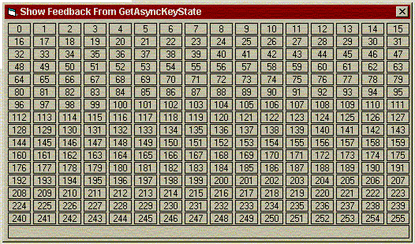



## Demonstrate GetAsyncKeyState \- handy when developing

### Description

Nothing pushing the limits of VB, but when developing games/apps and using GetAsyncKeyState, do you ever go, "Uhmm, what the hell is left arrow again?!". here you are. run this app, press the key (or combo) and there it is! I think this is more of a useful tool than a coding extravaganza, so please vote/comment accordingly. You never know, while you're writing your 1st class game, you may even use this tool! :-)
 
### More Info
 

             |
---                |---
**Submitted On**   |2003-07-25 09:54:06
**By**             |[Fosters](https://github.com/Planet-Source-Code/PSCIndex/blob/master/ByAuthor/fosters.md)
**Level**          |Beginner
**User Rating**    |5.0 (15 globes from 3 users)
**Compatibility**  |VB 5\.0, VB 6\.0
**Category**       |[Complete Applications](https://github.com/Planet-Source-Code/PSCIndex/blob/master/ByCategory/complete-applications__1-27.md)
**World**          |[Visual Basic](https://github.com/Planet-Source-Code/PSCIndex/blob/master/ByWorld/visual-basic.md)
**Archive File**   |[Demonstrat1619967252003\.zip](https://github.com/Planet-Source-Code/fosters-demonstrate-getasynckeystate-handy-when-developing__1-47159/archive/master.zip)

